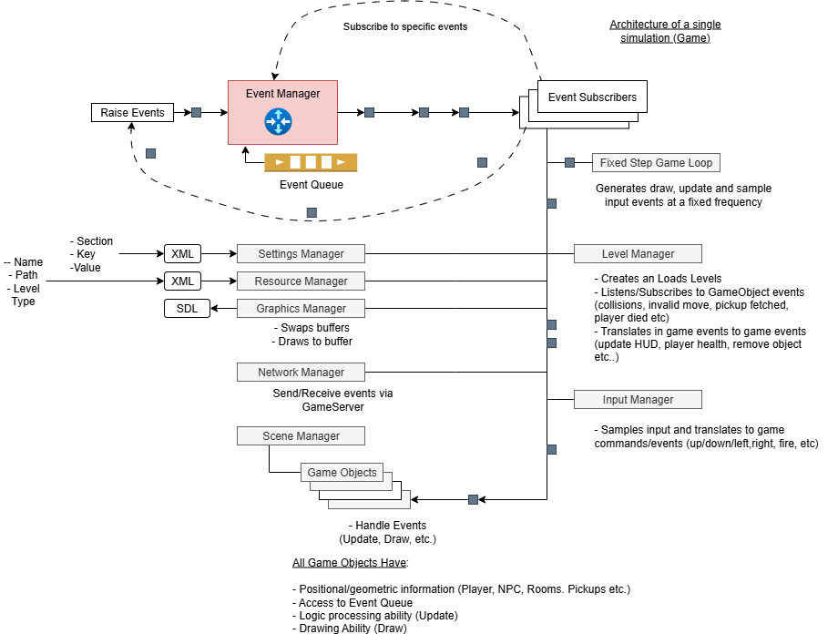

# Game2

This is an example of a building a simple game that is built using CppGameLib.

The game (called Game2) is comprised of the following files:

* main.cpp 
* GameCommands.cpp 
* InputManager.cpp 
* LevelManager.cpp

The game is built on a foundation of existing functionality provided by primarily the CppGameLib library which provides standard gaming functionality such:

* Settings (SettingsManager)
* Resource/asset management (ResourceManager)
* Event management (EventManager)
* Networking (NetworkManager)
* Game loop etc..

The components provided by CppGameLib and how the interact with a game (such as Game2) is shown in the following diagram:



In addition to CppGameLib, the game uses a game-specific library called Mazer which houses most of the game specific code such as the game characters, Level information etc. 

The game source files call into CppGameLib and Mazer to utilize this functionality and so much of the implementation for example of setting up the game loop in main.cpp is hidden. For example to start the game loop means calling a one-liner provided by CppGameLib.

```cpp
infrastructure.DoGameLoop(&mazer::GameDataManager::Get()->GameWorldData);

```

Other game specific code constructs such as Enemy classes are provided by Mazer, however new games might build all their code within the game itself and not call upon external libraries. Mazer however provides a lot of characters and game objects that are ready to use.

### Dependencies

The CppGameLib library depends on functionality provided by other libraries:

* SDL2 - For 2D drawing and controller input
* SDL2_ttf - Font loading 
* SDL2_mixer - Sound
* SDL2_image - Image/sprite loading
* Sodium - Networking encryption

The game build process ensures that the above dependencies, CppGameLib and Mazer are fetched, built and otherwise made available to the game during build/link time.

# Getting started

You need to ensure you have VCPKG and CMAKE installed.

VCPKG is used as the package manager to build these dependencies and make them available to the game when it builds.

CMake is used to generate the Visual Studio project files and build the game from the command line.

For example, CMake relies on VCPKG_ROOT environment variable being set (which it typically is if you install VCPKG). See CMakePresets.json


## Fetch Dependencies and Generate Project files

First, instruct vcpkg to fetch all the required dependencies:

```
cmake --preset=default
```

This will also generate the game project files and put them in the build folder.


This will install the games dependencies such as SDL2*, CppGamelib, mazer etc. These dependencies are listed in cmakelists.txt

## Build

Them once all the dependencies are built (and there are no errors), instruct the build system to build the game from the project files that were generated in the build folder:

```
cmake --build build
```
This will result in the game2.exe being built and linked to all the dependencies that it uses.

## Run the game

To run the game, run the game's executable:

```
build/game2.exe
```

# Structure of the file in Game2

* vcpkg.json

This contains the dependencies that vcpkg will attempt to find and build/install. The file looks like this:

```
{
  "dependencies": [
    "libmonad",
    "cppgamelib",
    "testlib",
    "mazer",
    "libsodium",
    "gtest",
    "sdl2",
    "sdl2-ttf",
    "sdl2-mixer",
    "sdl2-image"
  ]
}

```

* makelists.txt

This contains the reference to the game's source code and its dependencies (which should have been made available by running `vcpkg install`)

* CMakePresets.json

This holds information to generate the games project files (Visual Studio). It also specifies that these files should be put in a folder called 'build'. Additionally, this contains the integration between Vcpkg and CMake via the CMAKE_TOOLCHAIN_FILE variable. 

* vcpkg-configuration.json

Sets the repository locations where dependencies are pulled from. This is currently https://github.com/stumathews/vcpkg-registry. When new changes are makde to CppGameLib, Mazer etc, new versions of these dependencies are published here such that vcpkg can pull them down and build them. Each dependency has build information that describes how to build itself and make itself available to cmake.


